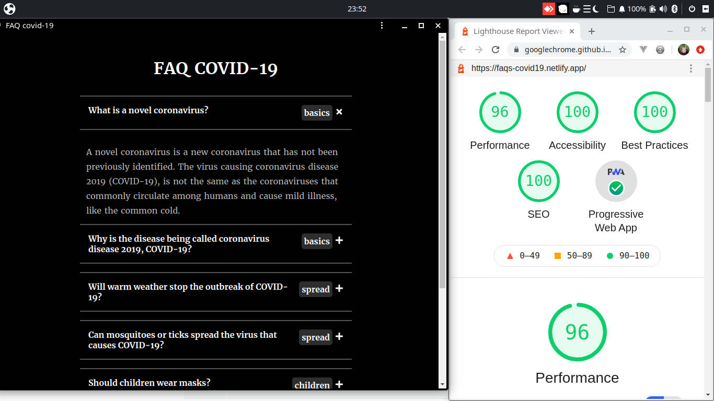

<h1 style="text-align: center">FAQ COVID-19 PWA</h1>

> simple **pwa** about app frequently asked questions *(FAQ)* about covid-19.
>
>created with the purpose of practicing ***styled component*** and the basic concepts of ***PWA***.

Live demo: [website](https://faqs-covid19.netlify.app/)
> **Note:** remember to install to be able use it as pwa.

Created with: 
- React 
- TypeScript
- Styled component
- PWA

*screenshot project (App and lighthouse)*